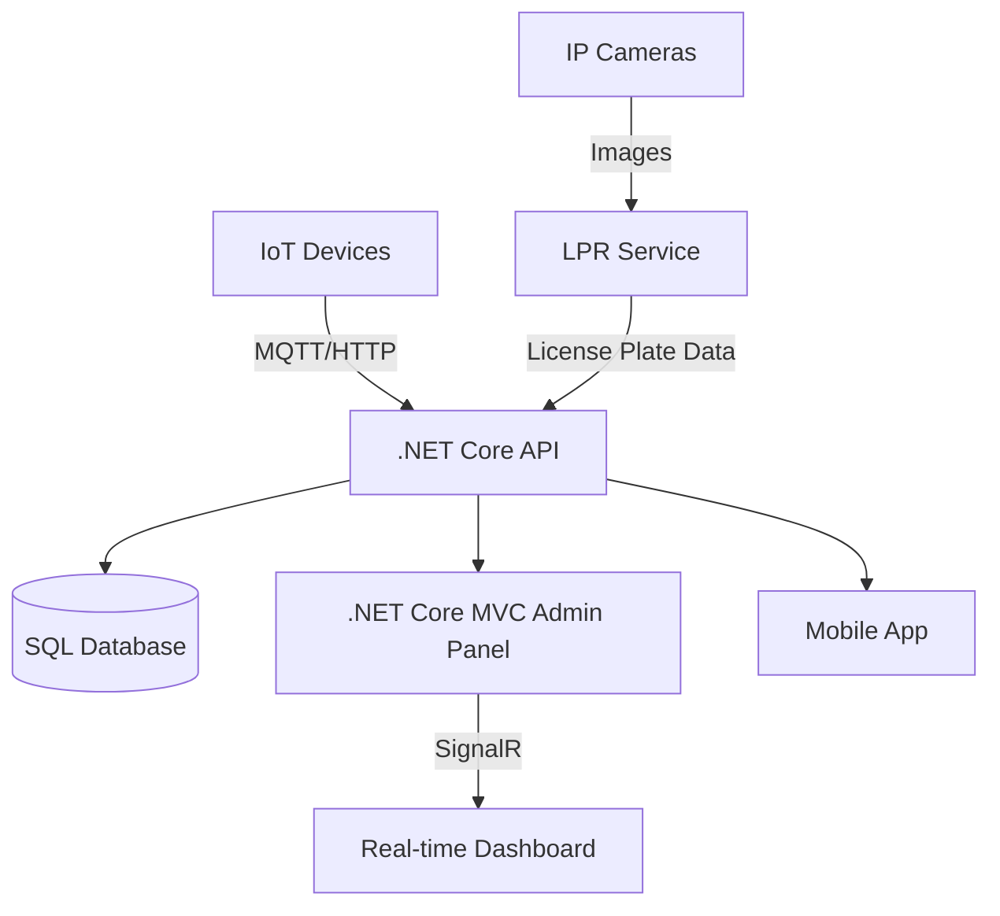

# **Smart Parking System with License Plate Recognition (LPR) using .NET Core MVC & API**

## **📌 System Architecture Overview**


## **🔧 Implementation Steps**

### **1. License Plate Recognition System**
#### **Option A: Python + OpenCV Microservice**
```python
# Flask API endpoint for LPR
@app.route('/recognize', methods=['POST'])
def recognize_plate():
    img = request.files['image'].read()
    plate = detect_plate(img)  # OpenCV + Tesseract
    return {'plate': plate}
```

#### **Option B: ML.NET in .NET Core**
```csharp
// In your .NET API
public string RecognizePlate(byte[] image)
{
    var model = MLContext.Model.Load("lpr-model.zip");
    var prediction = model.Predict(new PlateData { Image = image });
    return prediction.LicenseNumber;
}
```

### **2. .NET Core API Key Endpoints**
```csharp
// ParkingController.cs
[HttpPost("check-in")]
public async Task<IActionResult> CheckIn(IFormFile licensePlateImage)
{
    // Call LPR service
    var plate = await _lprService.Recognize(licensePlateImage);
    
    // Create parking record
    var ticket = new ParkingTicket {
        LicensePlate = plate,
        CheckInTime = DateTime.Now
    };
    
    _dbContext.Tickets.Add(ticket);
    await _dbContext.SaveChangesAsync();
    
    return Ok(ticket);
}

[HttpPost("check-out")]
public async Task<IActionResult> CheckOut(string licensePlate)
{
    // Calculate duration and fee
    var ticket = await _dbContext.Tickets
        .FirstOrDefaultAsync(t => t.LicensePlate == plate);
    
    var fee = CalculateFee(ticket.CheckInTime);
    
    return Ok(new { fee });
}
```

### **3. Real-time Dashboard with SignalR**
```javascript
// MVC View
const connection = new signalR.HubConnectionBuilder()
    .withUrl("/parkingHub")
    .build();

connection.on("UpdateParkingStatus", (slot) => {
    document.getElementById(`slot-${slot.id}`).className = 
        slot.occupied ? "occupied" : "available";
});

connection.start();
```

## **📊 Database Schema**
```sql
CREATE TABLE ParkingSlots (
    Id INT PRIMARY KEY,
    IsOccupied BIT DEFAULT 0,
    SensorId VARCHAR(50)
);

CREATE TABLE ParkingTickets (
    Id INT IDENTITY PRIMARY KEY,
    LicensePlate VARCHAR(20) NOT NULL,
    CheckInTime DATETIME2 NOT NULL,
    CheckOutTime DATETIME2,
    Fee DECIMAL(10,2)
);
```

## **🚀 Deployment Options**
1. **On-Premise**
   - Raspberry Pi + IP Cameras
   - Local SQL Server

2. **Cloud-Based**
   - Azure IoT Hub for device management
   - Azure Functions for LPR processing
   - Cosmos DB for storage

## **⚙️ Hardware Requirements**
| Component | Specification |
|-----------|---------------|
| Camera | 1080p IP Camera with night vision |
| Single-Board Computer | Raspberry Pi 4 (2GB+) |
| Sensors | Ultrasonic (HC-SR04) or magnetic |
| Network | WiFi/Ethernet connection |

## **📈 Advanced Features Roadmap**
1. **Phase 1**: Basic LPR + Parking Management
2. **Phase 2**: Mobile App Integration
3. **Phase 3**: Dynamic Pricing Algorithm
4. **Phase 4**: Facial Recognition for VIP Parking

## **💡 Pro Tips**
- Use **Background Services** in .NET for periodic sensor checks
- Implement **Redis caching** for frequently accessed slots
- Add **Plate Number Blurring** for GDPR compliance in stored images

Would you like me to elaborate on any specific component? Such as:
1. Detailed LPR implementation with sample code?
2. IoT sensor integration guide?
3. Payment gateway integration?
4. Deployment to Azure/AWS?
